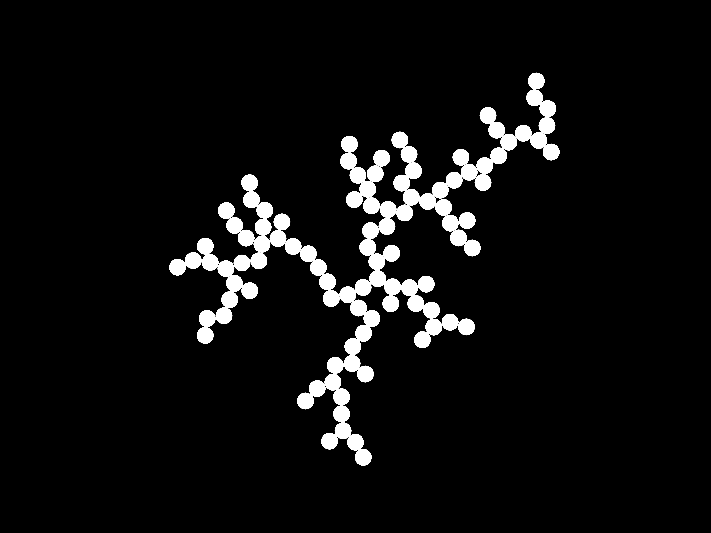

# dla
Diffusion-limited aggregation

## Intro

This is my mini-project for [Diffusion-limited aggregation](https://en.wikipedia.org/wiki/Diffusion-limited_aggregation). The motivation was to write a DLA simulation which scales efficiently with the number of particles added.

This project began as a Rust exercise (effectively an excuse to practice Rust programming) to implement Kasper R. Kuijpers' algorithm to [optimise DLA simulations](https://doi.org/10.1016/j.cpc.2013.12.003). The project has since been an attempt to further optimise Kasper's work, by attempting to reduce RAM usage where possible.

- [dla](#dla)
  - [Intro](#intro)
  - [How to Run](#how-to-run)
  - [Images](#images)
    - [100 Particles](#100-particles)
    - [100,000 Particles](#100000-particles)
  - [TODO](#todo)

## How to Run

Besides [having Rust installed](https://www.rust-lang.org/tools/install), you will need to ensure you have the appropriate build tools. For Windows you need to install the [Visual Studio C++ Build tools](https://visualstudio.microsoft.com/visual-cpp-build-tools/). If you are on Ubuntu-like Linux systems (e.g. I'm on Linux Mint), then you can install the required build tools, `build-essential`, via the following command:

    sudo apt install build-essential

Adjust the entries in `config.ini` to set the parameters for the DLA simulation, then in the root of this repository run: 

    cargo run --release

*N.B. recommended to use --release. It is a great deal faster than without the release flag.*

## Images

The following images were generated by the script `/py/plot_tree.py`. The `.csv` files needed to generate these graphs have also been included. Do feel free to run your own simulations and generate your own graphs!

### 100 Particles

### 100,000 Particles

## TODO

- Write benchmarks to test the total CPU time when performing simulations.
- Write code to extract fractal dimension, $D_f$ for 2D clusters and compare to published values.
- Document optimsations used within this repository.
- Code review Rust code and tidy/comment appropriately.
- Update model for 3D simulations?